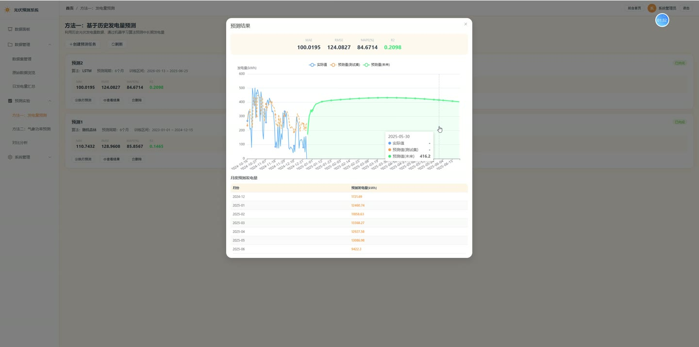
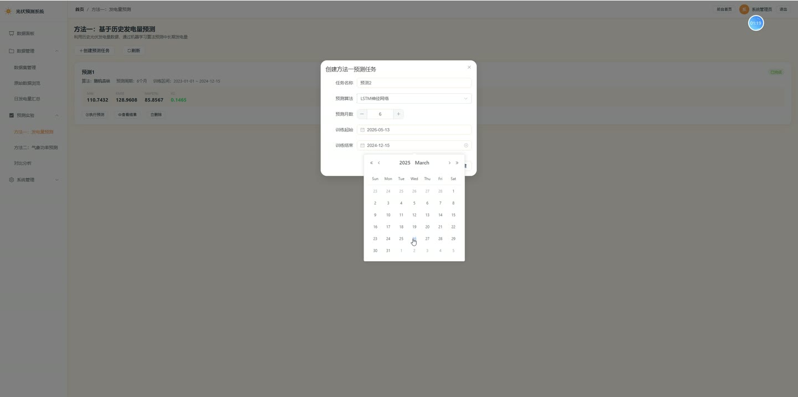
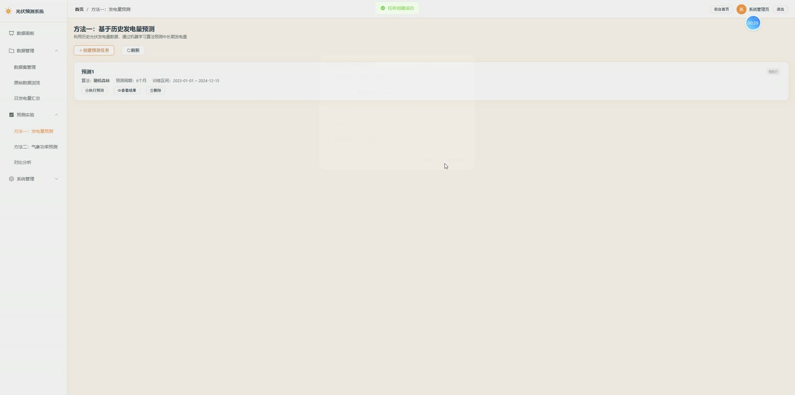
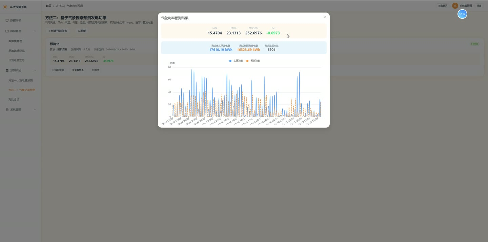
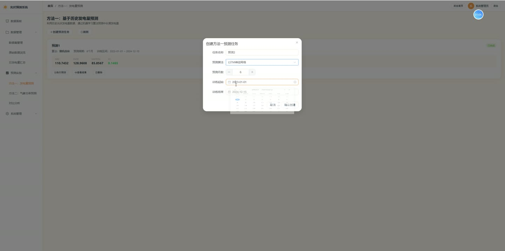

# (附文档)Python+Django+Vue3 光伏发电中长期电量预测方法设计

**技术栈**：Python、Django、机器学习、Vue3、MySQL

### 系统简介

本系统是一套基于 Python + Django + Vue3 的前后端分离光伏发电中长期电量预测平台，围绕光伏电站历史运行数据与气象数据，提供数据管理、机器学习预测建模、多算法对比分析与后台管理能力。系统分为前台展示端与后台管理端，后台按管理员角色统一管理数据、预测任务、对比分析与系统配置。
 
### 核心功能
 
### 管理员端

 
- 账号登录与登出：使用用户名与 MD5 加密密码校验，登录成功后写入 session 并记录登录日志。 
- 数据面板统计：展示发电量记录数、预测任务总数、已完成任务数、对比分析数四项指标。 
- 算法性能对比图：按算法聚合平均 MAPE 与平均 R2，以柱状图对比随机森林、LSTM、SVR、XGBoost 表现。 
- 预测方法准确率图：按方法一、方法二统计任务数量，以饼图展示两类方法占比。 
- 历史发电量趋势图：调用日发电量图表接口，按日期绘制发电量折线趋势。 
- 数据集管理：上传 Excel/CSV 数据集文件，列表展示名称、格式、记录数、描述与上传时间，支持删除。 
- 原始数据浏览：按数据集与日期筛选 15 分钟粒度记录，展示风速、风向、气温、气压、湿度、辐照度与目标功率。 
- 原始数据图表：按某天绘制功率曲线及辐照度、气温、湿度对比曲线。 
- 日发电量汇总：展示每日发电量、峰值功率、平均功率、有效日照点与数据点数，并绘制柱线组合图。 
- 方法一预测任务：创建任务并选择算法、预测月数、训练起止日期，执行预测并查看 MAE、RMSE、MAPE、R2 指标。 
- 方法一结果展示：绘制测试集实际值、测试集预测值与未来预测值折线，并列出月度预测发电量表。 
- 方法二预测任务：基于风速、风向、气温、气压、湿度、辐照度等气象因素预测发电功率，可配置算法与训练区间。 
- 方法二结果展示：展示测试集实际发电量、预测发电量与测试数据点数，并绘制实际功率与预测功率对比曲线。 
- 预测任务管理：按方法与算法筛选任务列表，查看任务状态、训练区间与评估指标，支持删除任务。 
- 对比分析创建：输入分析名称，多选至少两个已完成任务，填写分析结论生成对比记录。 
- 对比分析详情：以柱状图对比各任务 MAE、RMSE、MAPE、R2，并以表格列出方法、算法与各项指标。 
- 对比分析管理：列表查看关联任务 ID、结论与创建时间，支持删除。 
- 轮播图管理：新增、编辑、删除轮播图，支持填写标题、图片 URL、跳转链接、排序与显示状态，并可上传本地图片。 
- 用户管理：查看用户列表并按昵称关键字搜索，编辑昵称、邮箱、电话、角色与启用状态。 
- 操作日志：查看用户、操作类型、详情、IP 与时间等系统操作记录。
 
### 普通用户端

 
- 前台首页：展示轮播图与系统概览信息。 
- 关于页面：查看系统背景与整体介绍内容。 
- 方法一介绍页：了解基于历史发电量的预测方法说明。 
- 方法二介绍页：了解基于气象因素预测发电功率的方法说明。 
- 快捷登录入口：登录页提供管理员账号一键填充并登录。
 
### 技术栈

 后端框架Python + Django 接口风格Django 视图函数 + JSON 响应（code/msg/data） 会话与鉴权Django Session + MD5 密码校验 机器学习随机森林、LSTM、SVR、XGBoost 数据库MySQL 前端框架Vue3 UI 组件库Element Plus 状态管理Pinia（user store） 路由Vue Router（history 模式） 图表库ECharts 构建工具Vite
 
### 交付内容

 
- 后端完整源码 
- 前端完整源码 
- 数据库初始化脚本 
- 万字文档

## 界面展示

---

## 获取完整源码 + 万字文档

本仓库为项目介绍页。**完整前后端源码、数据库初始化脚本、万字项目文档**，请加微信 `kangkangcode`，或访问 [codekk.top](http://codekk.top) 获取。

可作课程设计 / 毕业设计参考，支持远程部署调试。